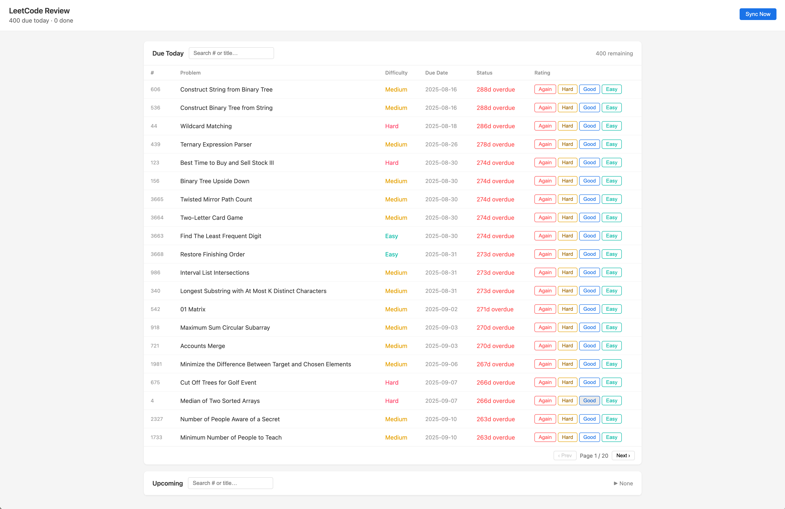

# leetcode-review

A self-hosted spaced-repetition system for LeetCode problems. It pulls your accepted submissions via the LeetCode GraphQL API and schedules them for review using the SM-2 algorithm.



---

## Architecture

```
.env
 └─ LEETCODE_SESSION
         │
         ▼
   lc_client.py          GraphQL API (leetcode.com)
   (iter_ac_submissions) ◄──────────────────────────
   (fetch_question_info)
         │
         ▼
      db.py  ──► leetcode.db (SQLite)
      (problems, reviews, sync_log tables)
         │
         ▼
      sm2.py  (SM-2 scheduling)
         │
         ▼
      app.py  (Flask, port 5001)
         │
         ▼
   templates/index.html  (single-page UI)
```

| File | Role |
|---|---|
| `app.py` | Flask routes, sync orchestration (background thread) |
| `lc_client.py` | LeetCode GraphQL client, pagination, retry/rate-limit handling |
| `sm2.py` | SM-2 algorithm — computes next interval and ease factor |
| `db.py` | SQLite schema, all reads and writes |
| `config.py` | Reads `.env`, exposes `LEETCODE_SESSION`, `DB_PATH`, `PORT` |
| `install.py` | macOS LaunchAgent installer/uninstaller |

---

## How the memory curve works (SM-2)

Each problem has three state variables stored in the `reviews` table:

| Variable | Initial | Meaning |
|---|---|---|
| `interval` | 1 day | Days until next review |
| `ease_factor` | 2.5 | Multiplier applied to interval after a successful review |
| `repetitions` | 0 | Consecutive successful reviews |

After each review you pick one of four ratings:

| Rating | Quality | Effect |
|---|---|---|
| Again | 1 | Reset: interval → 1, repetitions → 0 |
| Hard | 2 | Reset: interval → 1, repetitions → 0 |
| Good | 4 | Success: `new_interval = round(interval * ease_factor)` |
| Easy | 5 | Success: same formula, ease_factor increases more |

Ease factor update (clamped to min 1.3):

```
new_ease = ease_factor + 0.1 - (5 - quality) * 0.08 - (5 - quality)^2 * 0.02
```

Example progression for a problem you always rate "Good" (ease ≈ 2.5):

```
Review 1  →  due in  1 day
Review 2  →  due in  2 days
Review 3  →  due in  5 days
Review 4  →  due in 13 days
Review 5  →  due in 32 days
...
```

Rating "Hard" or "Again" resets the streak; rating "Easy" grows the ease factor faster, stretching future intervals further.

---

## Data flow

**Initial sync** (first run, up to `INITIAL_SYNC_LIMIT` problems):

```
POST /api/sync
  → background thread starts
  → lc_client pages through all accepted submissions (newest first)
  → for each new slug: fetch problem number + difficulty via GraphQL
  → upsert into problems table
  → init review row (due_date = first_solved_at date, interval=1, ease=2.5, reps=0)
  → log to sync_log
GET /api/sync/status  (poll until running=false)
```

**Incremental sync** (subsequent runs):

Same flow, but `since_ts` is set to the latest `first_solved_at` in the DB, so only new submissions are fetched.

**Daily review loop**:

```
GET /api/reviews
  → returns due[] (due_date <= today) and future[] lists

POST /api/review/<slug>  { "rating": "Good" }
  → sm2.calculate() → new interval, ease, due_date
  → update reviews table
  → return updated state
```

---

## Database schema

```sql
problems   (id TEXT PK, title, number, difficulty, url, first_solved_at INTEGER)
reviews    (problem_id FK, due_date TEXT, interval INT, ease_factor REAL, repetitions INT, last_reviewed_at TEXT)
sync_log   (id, synced_at INTEGER, new_problems INT)
```

---

## Setup

### Prerequisites

- Python 3.10+
- [uv](https://github.com/astral-sh/uv) (`curl -LsSf https://astral.sh/uv/install.sh | sh`)

### 1. Get your LeetCode session cookie

Log in to leetcode.com, open DevTools → Application → Cookies, copy the value of `LEETCODE_SESSION`.

### 2. Configure

```bash
cp .env.example .env   # or create .env manually
```

`.env`:
```
LEETCODE_SESSION=your_cookie_value_here
INITIAL_SYNC_LIMIT=200   # optional, default 200
```

### 3. Run (one-off)

```bash
uv run python app.py
```

Open [http://127.0.0.1:5001](http://127.0.0.1:5001), click **Sync** to import your solved problems.

### 4. Run on login (macOS only)

Registers a LaunchAgent so the server starts automatically:

```bash
uv run python install.py          # install
uv run python install.py --uninstall  # remove
```

Logs go to `~/Library/Logs/leetcode-review/`.

### 5. Tests

```bash
uv run pytest
```

---

## Environment variables

| Variable | Required | Default | Description |
|---|---|---|---|
| `LEETCODE_SESSION` | yes | — | LeetCode session cookie |
| `INITIAL_SYNC_LIMIT` | no | 200 | Max problems fetched on first sync |
